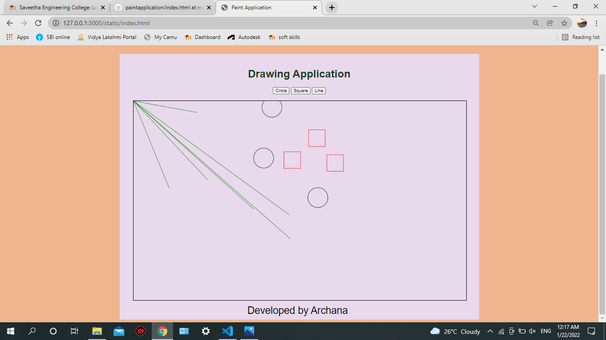

# Web Page for Paint Application

## AIM:

To design a static website for Paint Application using HTML5 canvas.

## DESIGN STEPS:

### Step 1:

Requirement collection.

### Step 2:

Creating the layout using HTML,CSS and canvas.

### Step 3:

Write javascript to capture move events.

### Step 4:

Perform the drawing operation based on the user input.

### Step 5:

Validate the layout in various browsers.

### Step 6:

Validate the HTML code.

### Step 6:

Publish the website in the given URL.

## PROGRAM :
```

<!DOCTYPE html>
<html lang="en">
  <head>
    <meta charset="UTF-8" />
    <meta http-equiv="X-UA-Compatible" content="IE=edge" />
    <meta name="viewport" content="width=device-width, initial-scale=1.0" />
    <title>Paint Application</title>
    <style>
      * {
        box-sizing: border-box;
        font-family: Arial, Helvetica, sans-serif;
      }
      body {
        background-color: rgb(240, 181, 142);
        color: #17421d;
      }
      .container {
        width: 1080px;
        margin-left: auto;
        margin-right: auto;
      }
      .content {
        display: block;
        width: 100%;
        background-color: #e9d9ec;
        min-height: 800px;
        margin: 100px 50px 0px 0px;
        padding-top: 20px;
      }
      h1 {
        text-align: center;
      }
      .footer {
        display: inline-block;
        width: 100%;
        height: 40px;
        margin: 0px 0px 0px 0px;
        text-align: center;
        padding-top: 10px;
        color: #000000;
        font-style:normal;
        font-size: 30px;
        padding-right: 10px;
      }
      canvas {
        margin-left: 40px;
        margin-right: 40px;
      }
      .toolbar {
        text-align: center;
      }
      .button{
        text-align: center;
      }
        

    </style>
    <script type="text/javascript">
    var shape;
    function myClickEvent (e) {
      var message;
    //message = "X=" + e.offsetX + ",Y=" e.offsetY;
    //alert(message);
    ctx.beginPath();
    if (shape == 0) {
      ctx.arc (e.offsetX, e.offsetY, 30, 0, 2 * Math.PI);
      ctx.strokeStyle = "black";
      ctx.linewidth = 3;
    } else if (shape == 1) {
      ctx. rect(e.offsetX, e.offsetY, 50, 50);
      ctx.strokeStyle = "red";
      ctx.linewidth = 3;
    } else if(shape == 2){
      ctx.moveTo(0,0);
      ctx.lineTo(e.offsetX,e.offsetY);
      ctx.strokeStyle = "green";
      ctx.linewidth = 3;


    }
    ctx.stroke();
  } 
  function circleclicked() {
    shape = 0;
  }
  function squareclicked () {
    shape = 1;
  }
  function filling () {
    shape = 2;
  }
  </script>
  </head>
  <body>
    <div class="container">
      <div class="content">
        <h1>Drawing Application</h1>
        <div class="button">
          <input type="button" id="circle" value="Circle"/>
          <input type="button" id="square" value="Square"/>
          <input type="button" id="fill" value="Line"/>

        </div>
      </br>
        <canvas
            id="myCanvas"
            width="1000"
            height="600"
            style="border: 1px solid #000000;"
            >
          </canvas>
          <div class="footer">
            Developed by Archana
          </div>
      </div>
    </div>
    <script>
       var c = document.getElementById("myCanvas");
       var ctx = c.getContext("2d");
       c.addEventListener("click",myClickEvent);
       document
         .getElementById("circle")
         .addEventListener("click", circleclicked);
       document
         .getElementById("square")
         .addEventListener("click", squareclicked);
       document
         .getElementById("fill")
         .addEventListener("click", filling);

    </script>
  </body>
</html>
```

## OUTPUT:



## Result:

Thus a website is designed and validated for paint application using HTML5 canvas.
